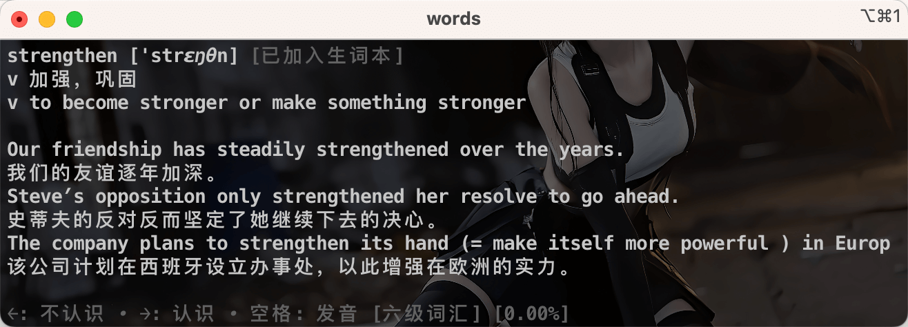
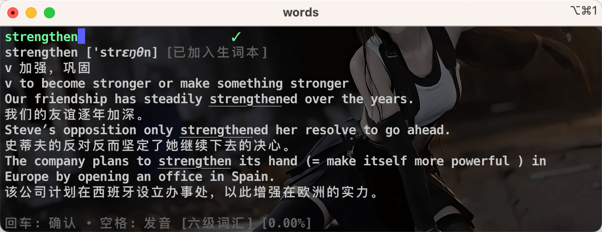
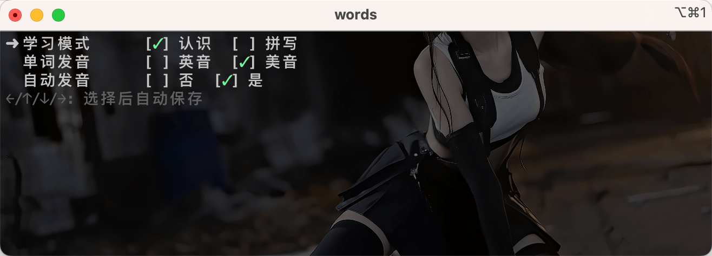
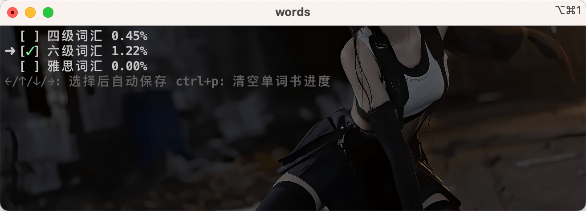
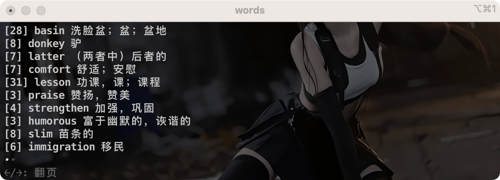

# words
> 极客就要用终端来背单词

## 安装
> 当前仅测试过 mac，其他平台未测试

### Homebrew
```bash
$ brew install LinkinStars/tap/words
```

### Manually
1. 下载并解压你想要的版本：https://github.com/LinkinStars/words/releases
2. `chmod +x words`
3. `mv words /usr/local/bin`
4. 使用 `words` 命令运行 

## 升级
```bash
$ words -u
```

## 预览
### 首页


### 认读模式


### 拼写模式(本人最爱)


### 设置


### 单词书


### 生词本


### 词典查询


## 用法
- 使用 `words` 命令启动
- 数字键 `1 2 3 4 5` 切换页面
- 空格键发音
- ctrl + ` 键 隐藏帮助信息
- `ctrl + c` 退出
- 其他请查看页面下方提示

## Q&A
- 数据存放在哪里？
  - 一般放在用户目录下的 words 目录下 `~/words` 用户可以通过指定环境变量 `WORDS_DATA` 来修改存档位置
  - 其中包括目录：
    - book(单词书) 
    - db(用户背诵数据) 
    - log(日志) 
    - voice(发音缓存文件)
  - 用户数据仅保存在本地，没有云端存储，可以尝试使用 iCloud 备份

---

- 如何开启 debug 模式
  - 通过指定环境变量 DEBUG=1
  - 如果遇到问题，建议先开启 debug 模式后，复现问题，查看日志后反馈 issue

---

- 支持平台？
  - 目前仅支持 macos 其他平台暂无测试，已知问题是其他平台无法正确发音

---

- 如何添加单词书
  - 按照 books 目录下 json 格式添加你需要的单词书就可以

## TODO
- [ ] 用户自定义每日计划单词数量
- [ ] 当前 input 有 bug 等待 [PR](https://github.com/charmbracelet/bubbles/pull/308) 被合并
- [ ] 每组单词背完回顾
- [ ] 每日单词背诵量统计到 dashboard
- [ ] 使用 API 进行单词查询
- [ ] 版本更新检测
- [ ] 单词书自动更新

### refactor
- [ ] 移除过多的全局变量
- [ ] Linux 适配
- [ ] Windows 适配

## 投币加速更新功能和单词书
> 今年过年期间顺手做的，每天晚上到家开终端默认打开，就会自己来上一把，现在自己的需求已经满足了

<div style="display: flex; justify-content: space-around;">


</div>
